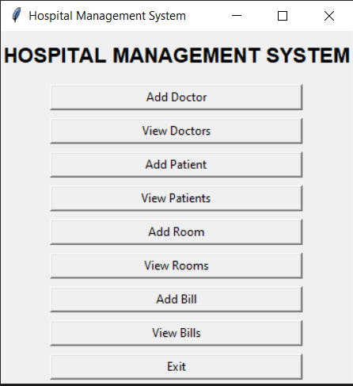
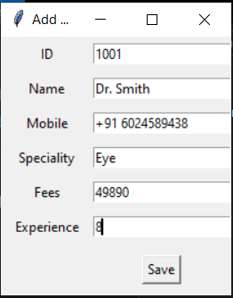

# Hospital Management System (Python)

A Hospital Management System developed using **Python, MySQL, and Tkinter GUI**.

This project was created as a learning exercise to understand:
- Database connectivity
- CRUD operations
- GUI-based applications
- Practical Python programming

## Features
- Doctor Management (Add / View)
- Patient Management (Add / View)
- Room Management (Add / View)
- Billing Management (Add / View)
- MySQL database integration
- Simple and clean Tkinter GUI

## Technologies Used
- Python
- Tkinter (GUI)
- MySQL
- PyMySQL

## How to Run
1. Make sure MySQL server is running
2. Update database credentials in `main.py`
3. Install dependency: pip install pymysql
4. Run the program: python main.py

##Screeshots

Main Application Window

Doctor Entry Form

## Project Type
- Academic Project

## Author
Shivam Budhiraja
